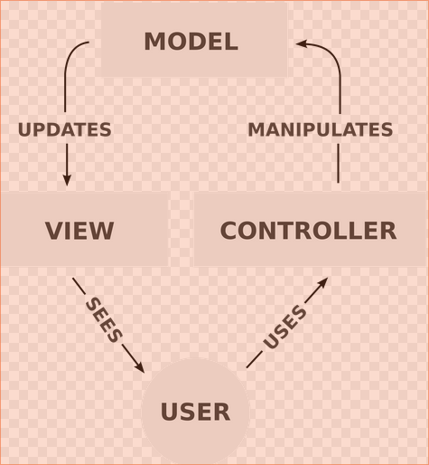

# docs

Contains any relevant docs that we may need to reference during developement.  
If you find a useful online source, put the link here.

For example, [click_me](http://www.w3schools.com/bootstrap/) to go to the bootstrap tutorial provided by w3school.

## Adding images

To add an image to this folder, place the pic in the _img_ folder.  

Just look at this readme.md in a text editor to see the syntax.  Its very straight forward.